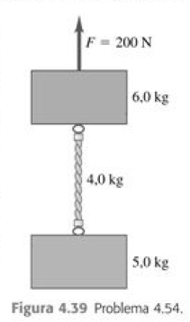

# Atividades de Física I

## Capítulo 3

### Atividade 3.3

Um projetista de páginas da Internet cria uma animação na qual um ponto da tela do computador possui posição $\vec{r} = [4,0 \text{ cm} + (2,5 \text{ cm/s}^2)t^2]\hat{i} + (5,0 \text{ cm/s})t\hat{j}$.  

a) Ache o módulo, a direção e o sentido da velocidade média do ponto para o intervalo entre $t_1 = 0$ e $t_2 = 2,0 \text{ s}$  

b) Ache o módulo, a direção e o sentido da velocidade instantânea para $t_1 = 0$ e $t_2 = 2,0 \text{ s}$.  

c) Faça um desenho da trajetória do ponto no intervalo entre $t_1 = 0$ e $t_2 = 2,0 \text{ s}$ e mostre as velocidades calculadas em (b).

### Atividade 3.6

A velocidade de um cachorro correndo em um campo aberto possui componentes $v_x = 2,6 \text{ m/s}$, $v_y = -1,8 \text{ m/s}$ para $t_1 = 10,0 \text{ s}$. Para o intervalo de tempo entre $t_1 = 10,0 \text{ s}$ e $t_2 = 20,0 \text{ s}$, a aceleração média do cachorro possui módulo igual a $0,45 \text{ m/s}^2$, formando um ângulo de $31,0^\circ$, medido considerando-se uma rotação do eixo $+Ox$ para o eixo $+Oy$. Para $t_2 = 20,0 \text{ s}$  

a) quais são os componentes $x$ e $y$ da velocidade do cachorro?  

b) Ache o módulo, a direção e o sentido da velocidade do cachorro.  

c) Faça um desenho mostrando o vetor velocidade para $t_1$ e para $t_2$. Qual é a diferença entre esses vetores?  

### Atividade 3.10
Um helicóptero militar em missão de treinamento voa horizontalmente com velocidade de 60,0 m/s e acidentalmente deixa cair uma bomba (felizmente não ativa) de uma altura de 300 m. Despreze a resistência do ar.  

a) Quanto tempo a bomba leva para atingir o solo?  

b) Qual a distância horizontal percorrida pela bomba durante a queda?  

c) Ache os componentes da velocidade na direção horizontal e na vertical imediatamente antes de a bomba atingir o solo.  

d) Faça diagramas $x-t$, $y-t$, $v_x-t$ e $v_y-t$ para o movimento da bomba.  

e) Mantida constante a velocidade do helicóptero, onde estaria ele no momento em que a bomba atingisse o solo?

## Capítulo 4

### Atividade 4.1
Duas forças possuem o mesmo módulo F. Qual é o ângulo entre os dois vetores quando a soma vetorial possui o módulo igual a  

a) 2F?  

b) $\sqrt{2}F$  

c) Zero?  

### Atividade 4.26
Um atleta joga uma bola de massa $m$ diretamente de baixo para cima, com resistência do ar desprezível. Desenhe um diagrama do corpo livre para essa bola enquanto ela está livre da mão do atleta e  

a) deslocando-se de baixo para cima;  

b) no seu ponto mais alto;   

c) deslocando-se de cima para baixo.  

d) Repita os itens (a), (b) e (c) considerando que o atleta joga a bola formando um ângulo de $60^{\circ}$ acima da horizontal, em vez de diretamente de baixo para cima.

### Atividade 4.43

Duas caixas, uma de massa de $4,0 \text{ kg}$ e outra de $6,0 \text{ kg}$, estão em repouso sobre a superfície sem atrito de um lago congelado, ligadas por uma corda leve (Figura 4.38). Uma mulher usando um tênis de solado áspero (de modo que ela possa exercer tração sobre o solo) puxa horizontalmente a caixa de $6,0 \text{ kg}$ com uma força $F$ que produz uma aceleração de $2,50 \text{ m/s}^2$.  

a) Qual é a aceleração da caixa de $4,0 \text{ kg}$?  

b) Desenhe um diagrama do corpo livre para a caixa de $4,0 \text{ kg}$. Use esse diagrama e a segunda lei de Newton para achar a tensão $T$ na corda que conecta as duas caixas.  

c) Desenhe um diagrama do corpo livre para a caixa de $6,0 \text{ kg}$. Qual é a direção da força resultante sobre a caixa de $6,0 \text{ kg}$? Qual tem o maior módulo, a força $T$ ou a força $F$?  

d) Use a parte (c) e a segunda lei de Newton para calcular o módulo da força $F$.  

### Atividade 4.51

Pulando para o solo. Um homem de 75,0 kg pula de uma plataforma de 3,10 m de altura acima do solo. Ele mantém as pernas esticadas à medida que cai, mas no momento em que os pés tocam o solo, os joelhos começam a se dobrar, e, considerando-o uma partícula, ele se move 0,60 m antes de parar.  

a) Qual é sua velocidade no momento em que os pés tocam o solo?   

b) Qual é sua aceleração (módulo e direção) quando ele diminui de velocidade, supondo uma aceleração constante?  

c) Desenhe o diagrama do corpo livre para ele (Seção 4.6). Em termos das forças que atuam no diagrama, qual é a força resultante sobre ele? Use as leis de Newton e os resultados do item (b) para calcular a força média que os pés dele exercem sobre o solo enquanto ele diminui de velocidade. Expresse essa força em newtons e também como um múltiplo do peso dele.  

### Atividade 4.54

Os dois blocos indicados na Figura 4.39 estão ligados por uma corda uniforme e pesada, com massa de 4,0 kg. Uma força de 200 N é aplicada de baixo para cima conforme indicado.  

a) Desenhe três diagramas do corpo livre, um para o bloco de 6,0 kg, um para a corda de 4,0 kg e outro para o bloco de 5,0 kg. Para cada força, indique qual é o corpo que exerce a referida força.  

b) Qual é a aceleração do sistema?  

c) Qual é a tensão no topo da pesada corda?  

d) Qual é a tensão no meio da corda?  

